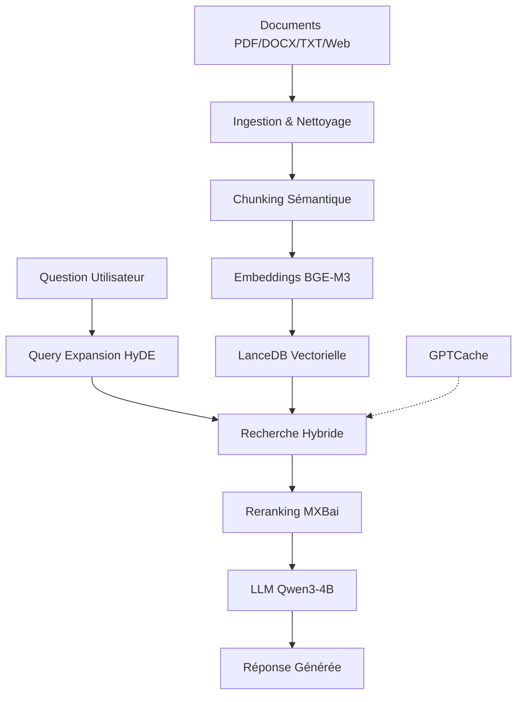

## 🚀 Installation Rapide

1. **Installer les dépendances** : `pip install -r requirements.txt`
2. **Installer / Lister / Changer / Supprimer un LLM** : `python models/llm/llm_model_installer.py`
3. **Lancer l'application** : `streamlit run app.py`
4. **Nettoyer les caches** : `python clear_cache.py`


# 🚀 VEV RAG - Agent RAG Haute Performance 100% Local

<div align="center">


**Agent RAG (Retrieval-Augmented Generation) haute performance fonctionnant 100% en local sur CPU.**

[](https://www.python.org/downloads/)
[](LICENSE)
[]()
[]()

</div>

---

## 📋 Table des Matières

- [À Propos](#-à-propos)
- [Fonctionnalités](#-fonctionnalités)
- [Architecture](#-architecture)
- [Installation](#-installation)
- [Utilisation](#-utilisation)
- [Structure du Projet](#-structure-du-projet)
- [Technologies](#-technologies)
- [Contribution](#-contribution)

---

## 🎯 À Propos

**VEV RAG** est un système de recherche documentaire intelligent qui combine :
- 🔍 **Recherche sémantique** avancée avec embeddings
- 🤖 **Génération de réponses** via LLM local (Qwen3-4B)
- 📚 **Ingestion multi-format** (PDF, DOCX, TXT, Web)
- 💾 **Base vectorielle hybride** (LanceDB)
- ⚡ **Performance CPU optimisée** (ONNX, GGUF)

Le projet fonctionne **entièrement en local**, sans dépendance cloud, garantissant confidentialité et autonomie.

---

## ✨ Fonctionnalités

### 🔥 Principales

- ✅ **Ingestion intelligente** : Support PDF, Word, TXT et pages web
- ✅ **Chunking sémantique** : Découpage intelligent par sens (2023)
- ✅ **Embeddings rapides** : BGE-M3 via FastEmbed (ONNX)
- ✅ **Recherche hybride** : Vectorielle + BM25/FTS
- ✅ **Reranking** : MXBai Rerank v2 pour affiner les résultats
- ✅ **Cache sémantique** : GPTCache pour accélérer les requêtes
- ✅ **LLM local** : Qwen3-4B quantifié (GGUF Q4_K_M)
- ✅ **Interface Streamlit** : Chat interactif avec upload de documents
- ✅ **Évaluation RAGAS** : Métriques de qualité automatiques

### 🛡️ Sécurité & Performance

- 🔒 **100% Local** : Aucune donnée ne quitte votre machine
- ⚡ **CPU Optimisé** : Fonctionne sans GPU
- 📊 **Évaluation continue** : Scores de fidélité et pertinence
- 🧹 **Nettoyage avancé** : ftfy, clean-text, Spacy

---

## 🏗️ Architecture



### Pipeline Complet

1. **Ingestion** : Docling (IBM 2024) convertit les documents en Markdown
2. **Nettoyage** : ftfy + clean-text + Spacy normalisent le texte
3. **Chunking** : Segmentation sémantique intelligente
4. **Vectorisation** : FastEmbed + BGE-M3 (ONNX, CPU-optimisé)
5. **Stockage** : LanceDB (hybride vectoriel + BM25)
6. **Recherche** : Query expansion (HyDE) + recherche hybride
7. **Reranking** : MXBai Rerank v2 affine le top-5
8. **Génération** : Qwen3-4B (GGUF Q4) génère la réponse
9. **Évaluation** : RAGAS mesure la qualité

---

## 📦 Installation

### Prérequis

- Python 3.10 ou supérieur
- 8 GB RAM minimum (16 GB recommandé)
- CPU moderne (pas de GPU requis)

### Installation Rapide

```bash
# Cloner le dépôt
git clone https://github.com/user257814938/VEV_RAG.git
cd VEV_RAG

# Créer un environnement virtuel
python -m venv venv
source venv/bin/activate  # Sur Windows: venv\Scripts\activate

# Installer les dépendances
pip install -r requirements.txt

# Télécharger les modèles
python src/scripts/download_reranker.py
```

### Configuration

Créez un fichier `.env` à la racine (optionnel) :

```env
# Chemins personnalisés (optionnel)
DATA_DIR=./data
MODELS_DIR=./models
```

---

## 🚀 Utilisation

### Interface Streamlit (Recommandé)

```bash
streamlit run app.py
```

Ouvrez votre navigateur à `http://localhost:8501`

### Utilisation Programmatique

```python
from main import VEVRAGAgent

# Initialiser l'agent
agent = VEVRAGAgent()

# Ingérer des documents
agent.ingest_documents(["document.pdf", "article.docx"])

# Poser une question
response = agent.query("Quelle est la définition de l'IA ?")
print(response)
```

### Tests

```bash
# Lancer les tests
pytest tests/

# Test d'ingestion
python tests/test_ingestion.py

# Test de recherche
python tests/test_retrieval.py
```

---

## 📁 Structure du Projet

```
VEV_RAG/
├── 📄 app.py                    # Interface Streamlit
├── 📄 main.py                   # Orchestration principale (VEVRAGAgent)
├── 📄 requirements.txt          # Dépendances Python
├── 📂 src/
│   ├── 📂 core/
│   │   ├── config.py           # Configuration & variables d'environnement
│   │   └── schemas.py          # Structures de données (Pydantic)
│   ├── 📂 ingestion/
│   │   ├── loader_doc.py       # Chargement PDF/DOCX (Docling)
│   │   ├── loader_web.py       # Extraction web (Trafilatura)
│   │   └── cleaner.py          # Nettoyage texte (ftfy, Spacy)
│   ├── 📂 indexing/
│   │   ├── chunker.py          # Chunking sémantique
│   │   ├── embedder.py         # Embeddings (FastEmbed + BGE-M3)
│   │   └── vector_store.py     # Base vectorielle (LanceDB)
│   ├── 📂 retrieval/
│   │   ├── cache.py            # Cache sémantique (GPTCache)
│   │   ├── query_expansion.py  # Amélioration requêtes (HyDE)
│   │   └── reranker.py         # Reranking (MXBai)
│   ├── 📂 generation/
│   │   ├── llm_engine.py       # Moteur LLM (Qwen3-4B GGUF)
│   │   └── system_prompts.py   # Prompts système
│   ├── 📂 evaluation/
│   │   └── ragas_eval.py       # Évaluation qualité (RAGAS)
│   └── 📂 scripts/
│       ├── download_reranker.py # Téléchargement modèles
│       └── verify_paths.py      # Vérification structure
├── 📂 data/
│   ├── raw/                    # Documents bruts
│   ├── processed/              # Documents traités
│   └── lancedb/                # Base vectorielle
├── 📂 models/
│   ├── llm/                    # Modèles LLM (GGUF)
│   └── embeddings/             # Modèles embeddings
└── 📂 tests/
    ├── test_ingestion.py       # Tests ingestion
    └── test_retrieval.py       # Tests recherche
```

---

## 🔧 Technologies

### Stack Complète

| Composant | Technologie | Année | Rôle |
|-----------|-------------|-------|------|
| **Ingestion** | Docling (IBM) | 2024 | Conversion PDF/DOCX → Markdown |
| **Web Scraping** | Trafilatura | 2019 | Extraction contenu web |
| **Nettoyage** | ftfy, clean-text, Spacy | 2012-2019 | Normalisation texte |
| **Chunking** | Semantic Chunking | 2023 | Segmentation intelligente |
| **Embeddings** | FastEmbed + BGE-M3 | 2023-2024 | Vectorisation ONNX |
| **Base Vectorielle** | LanceDB | 2023 | Stockage hybride (FTS + Vector) |
| **Cache** | GPTCache | 2023 | Accélération requêtes |
| **Query Expansion** | HyDE | 2022 | Amélioration requêtes |
| **Reranking** | MXBai Rerank v2 | 2024 | Affinage résultats |
| **LLM** | Qwen3-4B (GGUF Q4) | 2025 | Génération réponses |
| **Évaluation** | RAGAS | 2023 | Métriques qualité |
| **Interface** | Streamlit | 2019 | UI interactive |

### Dépendances Principales

```
docling>=2.0.0
trafilatura>=1.12.0
ftfy>=6.2.0
spacy>=3.7.0
fastembed>=0.3.0
lancedb>=0.13.0
gptcache>=0.1.43
llama-cpp-python>=0.2.0
ragas>=0.1.0
streamlit>=1.35.0
```

---

## 🤝 Contribution

Les contributions sont les bienvenues ! Pour contribuer :

1. Forkez le projet
2. Créez une branche (`git checkout -b feature/amelioration`)
3. Committez vos changements (`git commit -m 'Ajout fonctionnalité'`)
4. Pushez vers la branche (`git push origin feature/amelioration`)
5. Ouvrez une Pull Request

---

## 📄 License

Ce projet est sous licence MIT. Voir le fichier [LICENSE](LICENSE) pour plus de détails.

---

## 📞 Contact

Pour toute question ou suggestion, n'hésitez pas à ouvrir une [issue](https://github.com/user257814938/VEV_RAG/issues).

---

<div align="center">

**Fait avec ❤️ pour la communauté IA locale**

⭐ Si ce projet vous est utile, n'hésitez pas à lui donner une étoile !

</div>
